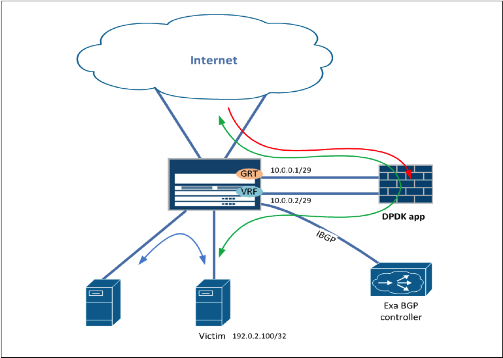

Deployment scenario
===================

There are plenty of different traffic diversion schemes. The only requirement is to pass traffic through purifier symmetrically. You can deploy it on your network in the same way as an other transparent stateful firewall like Cisco ASA or Juniper SRX is deployed. But if you have a Juniper MX route in your network I'd recomend an another deployment scheme.
I have the following requirements in my network:
- purifier shouldn't see all my traffic, instead it should see traffic belonging to the prefix I need.
- purifier should see traffic symmetrically (the original and the reverse directions)
- all my internal traffic (to and from the prefix of interest) shouldn't go through purifier
- on demand traffic diversion without reconfiguration of network equipment
- scaling, a possibility to divert a lot of prefixes

Consider traffic diversion and reinjection scheme with the one Juniper MX box:


- Red line is malicious traffic from the Internet to be dropped on purifier
- Green line is normal traffic from the Internet passes through purifier
- Blue line is local traffic. It shouldn't be diverted to purifier

Filtration loop interfaces configuration:
```
mx240> show configuration interfaces ae0 unit 100
description "Purifier external";
vlan-id 100;
family inet {
    address 10.0.0.3/29 {
        arp 10.0.0.2 mac 00:00:5e:00:01:14;
        vrrp-group 10 {
            virtual-address 10.0.0.1;
            accept-data;
        }
    }
}

mx240> show configuration interfaces ae0 unit 101 
description "Purifier internal";
vlan-id 101;
family inet {
    address 10.0.0.4/29 {
        arp 10.0.0.1 mac 00:00:5e:00:01:0a;
        vrrp-group 20 {
            virtual-address 10.0.0.2;
            accept-data;
        }
    }
}
```
Remark: Use an appropriate addressing instead of 10.0.0.0/29

VRF configuration
```
mx240> show configuration routing-instances VRF 
instance-type vrf;
interface ae0.101;
route-distinguisher 1.1.1.1:1;
vrf-target target:1:1;
routing-options {
    static {
        route 0.0.0.0/0 next-hop 10.0.0.1;
    }
}
```
Remark: Use an appropriate RD and vrf-target

Copy internal routes (learned from connected, static, IGP) from GRT (General Routing Table, your main routing table) to VRF
```
mx240> show configuration routing-options 
interface-routes {
    rib-group inet vrf;
}
static {
    rib-group vrf;
}
rib-groups {
    vrf {
        import-rib [ inet.0 VRF.inet.0 ];
        import-policy filter-purifier-loop;
    }
}

mx240> show configuration policy-options policy-statement filter-purifier-loop 
term 1 {
    from {
        route-filter 10.0.0.0/29 orlonger;
    }
    then reject;
}
term 2 {
    then accept;
}
```
copy IGP routes, for example OSPF ones
```
set protocols ospf rib-group vrf
```

Configure BGP session with controller
```
mx240> show configuration protocols bgp group exabgp 
type internal;
preference 5;
local-address 10.10.10.10;
import exa-policy;
family inet {
    unicast;
}
/* We don't need to announce our routes to the controller, only to recieve prefixes to protect */
export deny-all-routes;
peer-as 123;
neighbor 10.10.10.20 {
    description exabgp;
}

mx240> show configuration policy-options policy-statement exa-policy 
term 1 {
    from community SCUDCU;
    then {
        community add NOADVERT;
        accept;
    }
}
term 2 {
    then accept;
}

mx240> show configuration policy-options community SCUDCU 
members 123:6666;
mx240> show configuration policy-options community NOADVERT   
members no-advertise;
```
Remark: Copy paste is the root of evil. Please configure appropriate IP addresses and community strings ;)

Exporting routes with class information to the FIB:
```
mx240> show configuration routing-options forwarding-table 
export scudcu;

mx240> show configuration policy-options policy-statement scudcu 
term 1 {
    from community SCUDCU;
    then {
        destination-class purifier;
        source-class purifier;
        accept;
    }
}
term 2 {
    then accept;
}
```

Global filter:
```
mx240> show configuration forwarding-options family inet   
filter {
    output global-filter;
}

mx240> show configuration firewall family inet filter global-filter 
term 1 {
    from {
        interface ae0.100;
    }
    then {
        accept;
    }
}
term 2 {
    from {
        service-filter-hit;
    }
    then accept;
}
term 3 {
    from {
        source-class purifier;
    }
    then {
        service-filter-hit;
        routing-instance VRF;
    }
}
term 4 {
    from {
        destination-class purifier;
        source-prefix-list {
            internal_nets;
        }
    }
    then {
        routing-instance VRF;
    }
}
term 5 {
    then accept;
}
```
Remark: The prefix list internal_nets could contain RFC1918 prefixes, your global allocation prefixes etc.
Those prefixes are treated as trusted so all the traffic between them and victim's prefixes isn't diverted to purifier.

And don't forget to turn on rpf-check on internal interfaces (at least in loose mode) to resolve source class.
```
set interfaces ae0 unit 123 family inet rpf-check mode loose
```

How does it work
=================

If you need to divert traffic from the Internet to 1.1.1.1/32 (the victim) just announce it from exabgp controller with SCUDCU community
```
announce route 1.1.1.1/32 next-hop 10.0.0.2 community 123:6666
```
After that all the traffic from the Internet goes to purifier (10.0.0.2 is reachable via purifier filter loop) as well as all the traffic from trusted inetrnal nets goes directly to the victim server. This behavior is due to the fact that the route to 1.1.1.1/32 is installed into the FIB with an additional information - the source and the destination classes. We can verify it by checking the PFE:
```
NPC1(mx240 vty)# show route ip lookup 1.1.1.1
Route Information (1.1.1.1):
 interface : ae0.123 (456)
 Nexthop prefix : -
 Nexthop ID     : 1048582
 MTU            : 0
 Class ID       : 129
```
Class ID is the destination class. So now we have a match criteria availible on the dataplane.
Because of global filter's term 4 traffic going from internal prefixes is redirected to VRF which doesn't have BGP route received from controller and is forwarded towards victim.
The same is for reinjected traffic after purifier loop that arrives to VRF and forwards toward the victim server.

Source class is resolved with the help of rpf-check for traffic from victim's prefix. Due to global-filter's term 3 it is redirected to VRF.
If it is destined to the internet then it will be forwarded to a default route via 10.0.0.1 which means forwarding through purifier.
After passing purifier the reverse traffic is returned via ae0.100 interface and global filter's term 1 prevents packet loop due to redirecting to VRF.

P.S.
There is "not a bug but a feature" in the juniper's PFE. Leaked connected routes are handled in a different way than other ones.
So, if there is a routing lookup in VRF and the packet matches connected route that was leacked from inet.0 then PFE executes second routing lookup in source table for that route (in inet.0 in our case). 
This leads to a routing loop if a victim is directly connected to Juniper MX. Another case is when packet from a victim goes to a directly connected network leading to a packet loop inside PFE and consequently crushes PFE.

First problem can be solved in two ways: either terminate possible victim's networks on the other device (for example on aggregation switch) or move possible victim's directly connected networks to a separate VRF.
In the latter case create new VRF (lets name it publ-conn)

```
mx240> show configuration routing-instances publ-conn 
instance-type virtual-router;
interface ae0.123;
routing-options {
    interface-routes {
        rib-group inet publ-to-grt;
    }
    static {
        route 0.0.0.0/0 next-table inet.0;
    }
}

```
The copy routes not from inet.0 but from the new VRF to inet.0 and previously mentioned service VRF
```
rib-groups {
    publ-to-grt {
        export-rib publ-conn.inet.0;
        import-rib [ publ-conn.inet.0 inet.0 VRF.inet.0 ];
        import-policy filter-purifier-loop;
    }

```

The second problem was solved with the following hack:
In the global filter's term 3 a packet sourced from victim is marked with "service-filter-hit" and in term 2 marked packets are passed before the redirection rule preventing packet looping inside the PFE.
